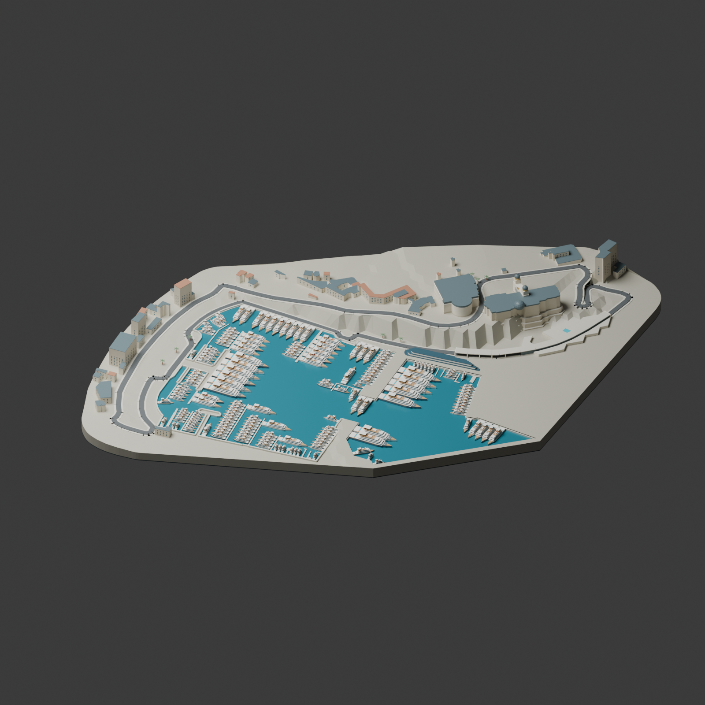
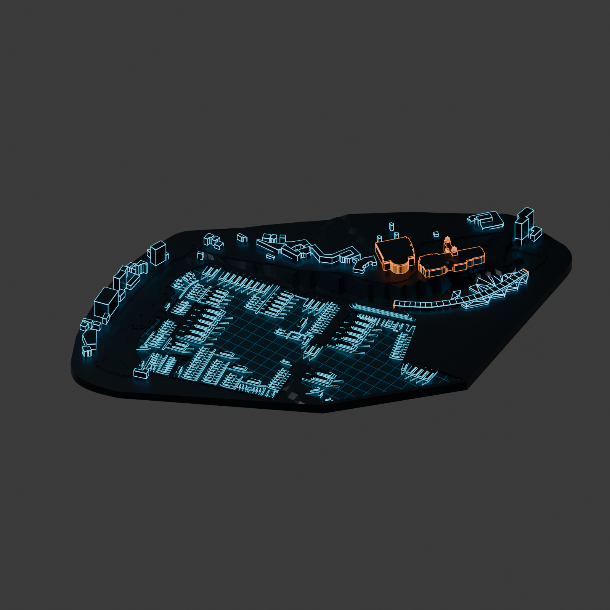
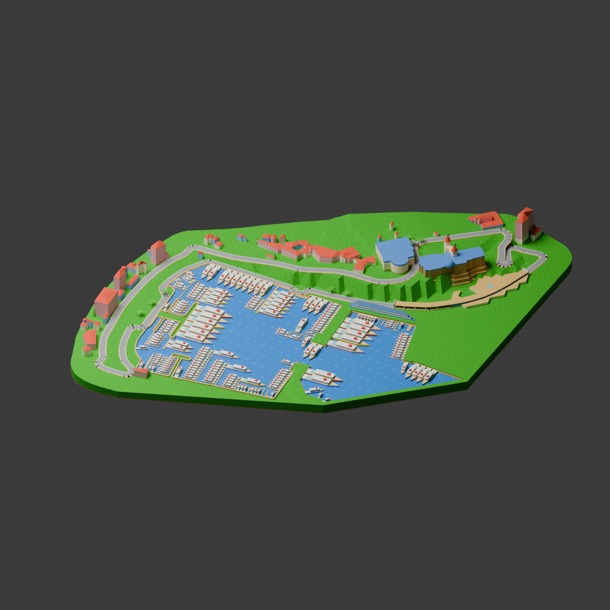

# Monaco themed tabletop

A compact, geographically aligned interpretation of Monaco, rather than a surveyed architectural model. Available in Tracks → Monaco → Grand Prix, Tron or Retro Kart. Tron uses the identical geography and docked fleet with dark metallic surfaces, emissive cyan architecture, amber landmark/portal accents and a clipped harbor grid. Retro Kart reinterprets Monaco as a 64-bit-era coastal raceway: pixel-textured grass and stone, sand-colored shoulders, gray roads with white edges, bright toy yachts, red pitched roofs, twin casino turrets, chunky palms and checkerboard tunnel/start gantries. F1 Miniature retains its existing scenery. The environment is deliberately restricted to the catalog coordinate frame; live/replay provider coordinates require an explicit registration before using it. The replay downloader now attempts that registration for Monaco, fitting a recorded lap to the catalog outline, preserving observed lateral motion and applying modeled road height. Fits over 25 m RMS are rejected; accepted fits retain their error and method in the private archive. Live positions are not yet registered.







## Sources and rights

Geographic database: **© OpenStreetMap contributors**, extracted 17 September 2026 through the Overpass API, under [ODbL 1.0](https://opendatacommons.org/licenses/odbl/1-0/). [Attribution and copyright](https://www.openstreetmap.org/copyright). `MonacoGeography.json` is the attributed derived geographic database. The bundled USDZ is a produced work derived from it; retain this attribution when redistributing. Original generator code and architectural embellishments follow the repository MIT license.

- Port Hercule: relation 2221179; actual basin outline and mapped piers.
- Casino / Opera: way 161769674.
- Hôtel de Paris: relation 8280869.
- Fairmont: relation 2093796.
- Yacht Club: relation 8269572.
- Boulevard Louis II tunnel: way 4230891.
- 45 nearby building footprints and 21 pier geometries retain their OSM IDs in the JSON.
- Circuit outline/elevation: the existing `Season2026.json`, with provenance documented in `../../ELEVATION.md` and repository `THIRD_PARTY.md`.

Heights from OSM are used where available, otherwise estimated. Heights are limited to 6–48 m for tabletop legibility. Terrain between roads is interpolated, not surveyed. Casino towers, hotel roofs, windows, palm trees and yachts are original stylized approximations. The densely dressed harbor contains 183 yachts, including 13 ninety-meter megayachts, with pools, stepped decks, lounges, canopies, guests and large-yacht helipads. Yachts are arranged stern-to in rows along mapped quay and pier faces, with boarding gangways. Positions are decorative, not live vessel data or actual berth assignments. The basin remains open between docked rows. Hull clearance is checked against the mapped water, piers and other vessels. Casino and Hôtel de Paris have stepped retaining foundations; surrounding buildings have supporting bases. These are visual corrections, not surveyed foundation geometry. The Boulevard Louis II tunnel has a continuous roof, dark inland wall, seaward columns, and entrance/exit portals. Cars are naturally hidden beneath the solid roof when viewed from above. The OSM tunnel path is projected onto the rendered racing centerline (the two differ by up to 7.3 m) so the cover follows the road. [FIA circuit map](https://www.fia.com/system/files/decision-document/2025_monaco_grand_prix_-_race_directors_event_notes_-_circuit_map_pit_lane_map_ers_battery_containment_area_red_zones.pdf) identifies the entrance and exit. No Google imagery or extracted Google geometry is included.

## Rebuild

Run `python tools/check_monaco.py` to verify complete harbor coverage, upward-facing terrain/water triangles and compact bounds. Native `--validate-monaco` checks asset loading, theme switching and rotation/size fitting.

Python 3 with numpy and Shapely 2.1+, Blender 5.2. Run from `visionos`:

```sh
python tools/prepare_monaco.py osm.json relations.json Sources/Resources/Season2026.json Assets/Monaco/MonacoGeography.json
python tools/dress_monaco.py Assets/Monaco/MonacoGeography.json
blender --background --factory-startup --python tools/build_monaco_blender.py -- Assets/Monaco/MonacoGeography.json Sources/Resources/MonacoGrandPrix.usdz preview.png
blender --background --factory-startup --python tools/build_monaco_blender.py -- Assets/Monaco/MonacoGeography.json Sources/Resources/MonacoTron.usdz tron-preview.png tron
blender --background --factory-startup --python tools/build_monaco_blender.py -- Assets/Monaco/MonacoGeography.json Sources/Resources/MonacoKart.usdz kart-preview.png kart
```

The committed sanitized geographic JSON is sufficient for the Blender step; no network access or account is required. To refresh source extracts, use Overpass `out body geom` for ways tagged building, coastline, pier, marina or tunnel in bbox `(43.731,7.417,43.743,7.432)`, and the relations listed above. The preparation script strips unrelated metadata, including public contact fields.

The asset is exported in meters, Y up, with the same 0.55 m normalization as `TableScene.project`. Runtime applies the shared elevation offset and fits the complete circuit environment to the current volume. It must not be independently renormalized as a vehicle model.

## Retro Kart design direction

The visual references were Mario Kart 64’s Royal Raceway, Luigi Raceway, Koopa Troopa Beach and Toad’s Turnpike. The bundled environment uses original procedural geometry and 32×32 nearest-filtered textures, not extracted game assets, characters, logos or screenshots. Geographic locations, dock assignments, elevation and shared tabletop fitting remain consistent with the other Monaco styles. Stylized roofs, turrets, colors and toy boats are artistic interpretations. Monaco’s road is kept narrow enough to pass inside its mapped tunnel rather than applying the wider generic kart road.
