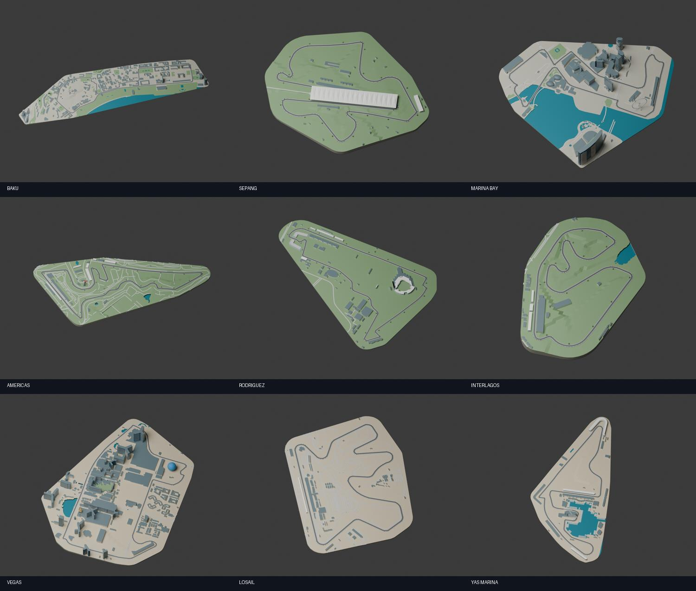
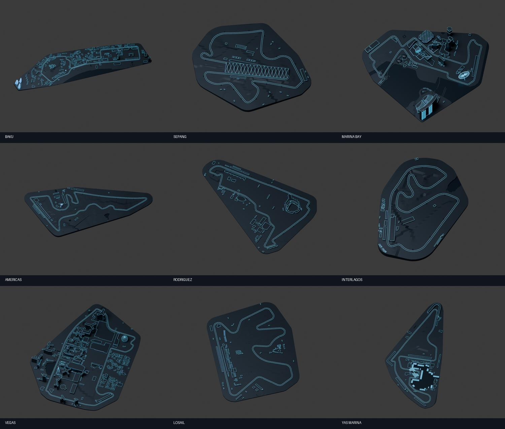
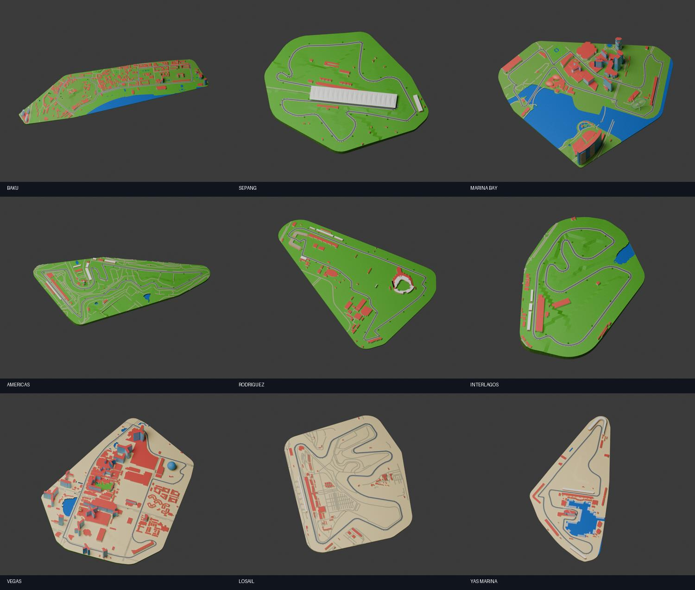

# 2026 remaining-season tabletop scenery

Geographically grounded, compact tabletop interpretations for the nine events from Baku onward. The same geography is restyled in Grand Prix, Tron and Retro Kart. F1 Miniature reuses the Grand Prix geographic environment with its own vehicle theme.

| Circuit | Characteristic surroundings |
| --- | --- |
| Baku | Old City walls, Maiden Tower, Flame Towers, Government House, Caspian waterfront |
| Sepang | Central umbrella-canopy grandstand, pit complex, terrain height estimate |
| Singapore | Marina Bay shoreline, Marina Bay Sands towers and SkyPark, Flyer, Esplanade, city buildings |
| Austin | Observation tower with red ribbons, grandstands, pit complex and mapped service roads |
| Mexico City | GNP stadium's two mapped seating blocks framing the road, nearby stadium and park buildings |
| Interlagos | Pit buildings, grandstands, mapped lakes and course elevation |
| Las Vegas | Sphere, Eiffel Tower, Bellagio/Venetian massing, mapped water and Strip buildings |
| Lusail | Paddock, grandstands, desert setting and decorative floodlights |
| Yas Marina | Hotel lattice spanning the road, marina and docked decorative yachts, grandstands |







These are Blender previews of the exported environment assets; native cars and floating windows are added by the app.

## Sources and accuracy

**© OpenStreetMap contributors**, [ODbL 1.0](https://opendatacommons.org/licenses/odbl/1-0/), extracted 18 September 2026 using Overpass and the public OSM map API. Each circuit JSON is an attributed derived geographic database retaining relevant source IDs. [OSM copyright](https://www.openstreetmap.org/copyright). This data is not relicensed under the repository MIT code license. Bundled USDZ scenery is a produced work; retain attribution when redistributing. Original generator code and decorative modeling use the repository MIT license.

Circuit outlines are from [bacinger/f1-circuits](https://github.com/bacinger/f1-circuits), MIT, aligned to `Sources/Resources/Season2026.json`. Elevation provenance is in [ELEVATION.md](../../ELEVATION.md). Sepang alone uses a 30 m SRTM terrain estimate via [Open Topo Data](https://www.opentopodata.org/datasets/srtm/); it is not recorded road elevation. Terrain between road samples is interpolated, not surveyed. OSM heights/floors are used where present; missing heights and landmark details are approximate. Buildings are capped at 220 per circuit for tabletop performance. Architectural silhouettes, windows, canopies, lights, trees and boats are stylized, not exact licensed building models. Boats are decorative berth arrangements, not live vessel data.

Landmark references include [Austin's tower architect](https://www.mirorivera.com/observation-tower), [Mexico GP's official map](https://www.mexicogp.mx/mapa/) and [Singapore GP's circuit park map](https://singaporegp.sg/en/event-info/eventguide/general/circuit-park-map/). No Google satellite imagery or extracted Google geometry is bundled.

Assets share the catalog's local-meter frame. Live and replay registration preserves observed lateral positions and applies modeled road height; poor fits are rejected. No missing car observations are invented. One active environment is cloned from a bounded two-template cache. Volume fitting uses the entire circuit and its surroundings.

## Rebuild

Requires Python 3 with numpy and Shapely 2.1+, Blender 5.2. From the repository root:

```sh
python3 visionos/tools/fetch_season_sources.py /tmp/pitwall-season
python3 visionos/tools/prepare_season_scenery.py /tmp/pitwall-season visionos/Sources/Resources/Season2026.json visionos/Assets/Season
# Optional: refresh Sepang's cached terrain profile, then rerun preparation.
python3 visionos/tools/fetch_sepang_terrain.py
python3 visionos/tools/prepare_season_scenery.py /tmp/pitwall-season visionos/Sources/Resources/Season2026.json visionos/Assets/Season
python3 visionos/tools/build_season_assets.py /tmp/pitwall-season
python3 visionos/tools/check_season_scenery.py
python3 visionos/tools/check_circuit_catalog.py
sh visionos/tools/check_live_registration.sh
```

The builder creates editable `.blend` files, PNG previews and USDZ files named `<circuit>-<style>` in the output directory. Copy the USDZs to `Sources/Resources/Scenery_<circuit>_<style>.usdz` before rebuilding the app. `BLENDER` can override the default macOS Blender executable. Pass circuit IDs after the output directory to rebuild a subset.

Native DEBUG `--validate-season-scenery` loads all nine circuits in all four themes, checking volume containment at three rotations and two sizes (216 fits). It writes `Documents/season-scenery-validation.json`. This is separate from physical headset acceptance and live race validation.
